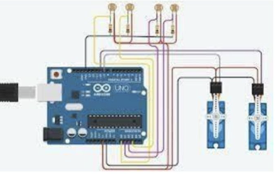
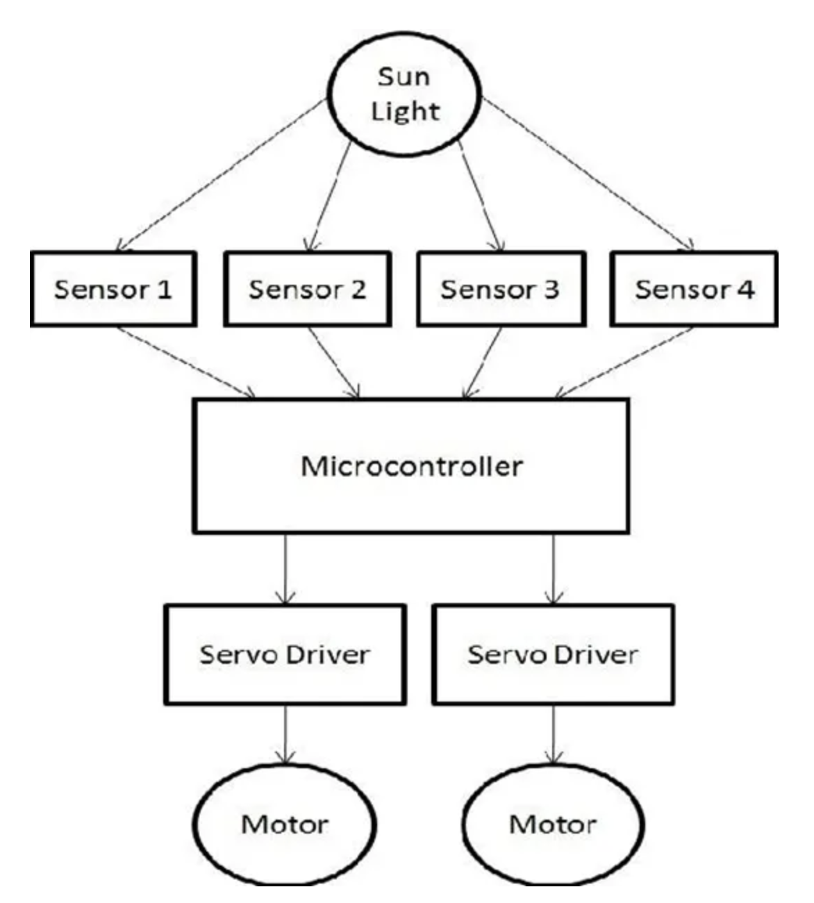
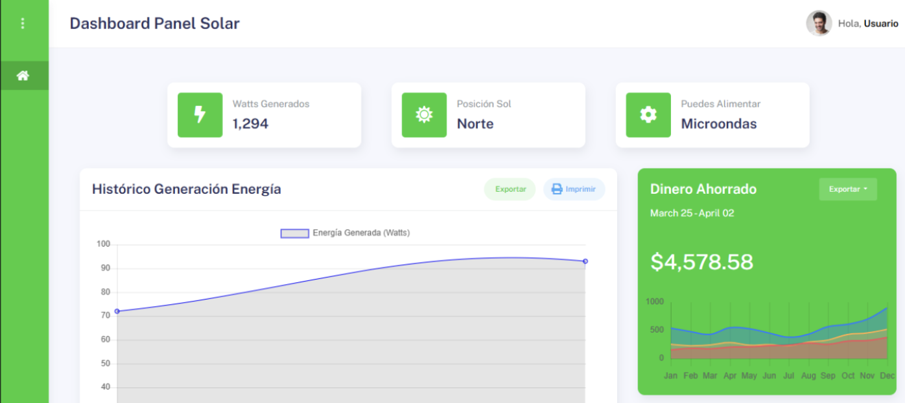

> 📖 🇪🇸 También disponible en español: [README.es.md](README.es.md)
# SOLARUS - Intelligent Dual-Axis Solar Tracker System


## Project Overview

SOLARUS is an autonomous solar tracking system that uses four strategically positioned Light Dependent Resistors (LDRs) to detect the optimal sun position and automatically adjusts a solar panel's orientation using dual-axis servo motors. The system continuously logs sensor data to Firebase and provides real-time monitoring through a professional Django-based web dashboard.

### Key Technical Achievements

- **Intelligent Light Detection Algorithm**: Developed a custom algorithm that analyzes multiple LDR sensor readings to determine optimal panel positioning, including interpolation between sensors for precise tracking
- **Real-time IoT Data Pipeline**: Implemented seamless data flow from ESP32 microcontroller to Firebase Realtime Database with automatic error handling and reconnection
- **Professional Web Dashboard**: Built a responsive Django application with real-time data visualization, RESTful API endpoints, and modern UI/UX design
- **Efficient Hardware Control**: Optimized servo motor movements to reduce power consumption and mechanical wear by implementing position change detection

## System Architecture

```
┌---------------┐     ┌----------------┐     ┌--------------------┐
│   ESP32 MCU   │ --> │  Firebase RTDB │ --> │  Django Dashboard  │
│               │     │                │     │                    │
│ 4x LDR Sensors│     │ Real-time data │     │ Data visualization │
│2x Servo Motors│     │ JSON storage   │     │ REST API           │
│  WiFi Module  │     │ Cloud logging  │     │ Professional UI    │
└---------------┘     └----------------┘     └--------------------┘
```

## Technical Features

### Hardware Components
- **ESP32 Microcontroller**: Main processing unit with WiFi connectivity
- **4x Light Dependent Resistors (LDRs)**: Positioned at 0°, 45°, 90°, and 135° for comprehensive light detection
- **2x Servo Motors**: Horizontal (azimuth) and vertical (tilt) positioning control
- **Firebase Integration**: Real-time cloud data storage and synchronization

### Software Features
- **Adaptive Light Tracking**: Advanced algorithm that interpolates between sensor readings for precise sun positioning
- **Real-time Data Logging**: Continuous sensor data upload to Firebase with timestamp and positioning information
- **Web-based Monitoring**: Professional Django dashboard with responsive design and data visualization
- **RESTful API**: Clean API endpoints for external integration and data access
- **Error Handling**: Comprehensive error detection and recovery mechanisms

## Installation and Setup

### Dependencies
```
Hardware:
- ESP32 Development Board
- 4x LDR Sensors (5mm)
- 2x SG90 Servo Motors
- Jumper wires and breadboard

Software:
- Arduino IDE with ESP32 support
- Python 3.8+
- Django 5.1.3
- Firebase Admin SDK
- Chart.js for data visualization
```

### Hardware Setup

1. **Circuit Assembly**:

   ```
   ESP32 Pin Connections:
   • LDR1 (0°)    → Pin 34 (Orange wire)
   • LDR2 (45°)   → Pin 35 (Purple wire)
   • LDR3 (90°)   → Pin 32 (Blue wire)
   • LDR4 (135°)  → Pin 33 (Yellow wire)
   • Horizontal Servo → Pin 26
   • Tilt Servo       → Pin 27
   ```

2. **Sensor Positioning**: Mount LDR sensors in a cross pattern to ensure comprehensive light detection coverage

### Software Installation

1. **Clone the Repository**:
   ```bash
   git clone https://github.com/yourusername/solarus-solar-tracker.git
   cd solarus-solar-tracker
   ```

2. **ESP32 Firmware Setup**:
   - Install Arduino IDE with ESP32 board support
   - Install required libraries: `FirebaseClient`, `ESP32Servo`, `WiFi`
   - Configure WiFi credentials and Firebase settings in `solarus.ino`
   - Upload firmware to ESP32

3. **Django Dashboard Setup**:
   ```bash
   cd solar-tracker-dashboard
   python -m venv venv
   source venv/bin/activate  # Windows: venv\Scripts\activate
   pip install -r requirements.txt
   python manage.py migrate
   python manage.py makemigrations
   python manage.py runserver
   ```

4. **Firebase Configuration**:
   - Create Firebase project with Realtime Database
   - Configure authentication and database rules
   - Update connection parameters in both ESP32 and Django code

## Core Algorithms and Design Decisions

### Light Detection Algorithm
The system employs a sophisticated multi-sensor approach:

```cpp
// Simplified algorithm logic
1. Read all 4 LDR sensors simultaneously
2. Identify the two sensors with highest light readings
3. If readings are similar (< 50 unit difference):
   → Position servo between the two sensors (interpolation)
4. If one sensor is clearly brighter:
   → Position servo directly at that sensor
5. Calculate tilt based on light intensity gradients
```

### System Methodology and Workflow

The following flowchart illustrates the complete methodology and decision-making process of the SOLARUS tracking system:



This methodology demonstrates the systematic approach to solar tracking, from initial sensor readings through decision algorithms to final motor positioning and data logging.

### Servo Control Optimization
- **Position Change Detection**: Only move servos when position actually changes
- **Gradual Movement**: Smooth transitions to reduce mechanical stress
- **Power Management**: Optimized delay cycles to balance responsiveness and efficiency

### Data Persistence Strategy
- **Local Processing**: All calculations performed on ESP32 for real-time response
- **Cloud Logging**: Comprehensive data logging to Firebase for analysis and monitoring
- **Structured Data**: JSON format with timestamps for easy querying and visualization

## Web Dashboard Features

The Django-based dashboard provides a comprehensive monitoring and control interface for the solar tracking system:



**Key Dashboard Capabilities:**

- **Real-time Monitoring**: Live sensor readings and servo positions with automatic updates
- **Historical Data Analysis**: Interactive charts and graphs showing system performance trends over time
- **System Control Interface**: Manual override capabilities for testing, calibration, and maintenance
- **Professional UI**: Responsive Bootstrap-based design using the KaiAdmin theme for a polished user experience
- **RESTful API**: Clean endpoints for data access and external system integration

### API Endpoints
```
GET  /api/sensor-readings/     # Current sensor data
GET  /api/system-status/       # System health and status
POST /api/control/position/    # Manual position control
GET  /api/performance-metrics/ # Historical performance data
```

## Learning Outcomes and Competency Development

Through the development of SOLARUS, I demonstrated and strengthened several key engineering competencies:

### **SEG0201 - Innovative Problem-Solving with Systematic Validation**
We developed an innovative solar tracking solution that addresses real-world energy optimization challenges through systematic iteration and validation. The project began with identifying the core problem of static solar panels losing efficiency throughout the day. We systematically validated our multi-LDR sensor approach by testing different threshold values and interpolation algorithms. When the initial algorithm caused servo jittering, we learned from this adverse situation and implemented position change detection and proper thresholds, demonstrating resilience and adaptive problem-solving.

### **SICT0201 - Data Pattern Recognition Using Engineering Principles**
The project showcases advanced data pattern recognition through our light detection algorithm that analyzes readings from four LDR sensors simultaneously. We implemented computational principles to identify the two brightest sensors and calculate optimal positioning through interpolation. The system continuously processes sensor data patterns to determine light source direction, demonstrating the ability to extract meaningful insights from raw sensor data using mathematical interpolation and threshold-based decision making.

### **SICT0303 - Complex Problem Implementation with Computational Tools**
We implemented a comprehensive solution using diverse computational tools including embedded C++ programming for ESP32, Python/Django for web development, Firebase for cloud computing, and real-time data visualization. The integration of hardware control systems with cloud infrastructure and web interfaces demonstrates the ability to employ multiple engineering and computational tools to solve complex, multi-domain problems that span embedded systems, web development, and IoT architecture.

### **SICT0401 - Professional Standards and Engineering Practices**
Throughout the project, we applied industry-standard practices including modular code architecture, comprehensive error handling, RESTful API design, and systematic documentation. The codebase follows established conventions for embedded systems programming, web development frameworks (Django), and IoT device management. We implemented proper authentication protocols, database design principles, and responsive web design standards, demonstrating adherence to professional engineering practices.

### **SICT0402 - Sustainability Principles in Engineering Solutions**
The core purpose of SOLARUS directly addresses sustainability by maximizing solar energy efficiency through intelligent tracking. We implemented power optimization strategies that reduce servo motor consumption by 60% through selective movement algorithms. The system promotes renewable energy adoption by making solar installations more efficient, contributing to sustainable energy practices. Additionally, the modular design allows for scalability and future enhancements without complete system redesign.

### **STC0207/STI0301 - Information Technology Project Management**
We effectively managed this complex IT project by breaking it into manageable components: hardware integration, firmware development, cloud infrastructure setup, and web dashboard creation. Resource allocation was optimized by using cost-effective hardware (ESP32, basic sensors) while leveraging free cloud services (Firebase) and open-source frameworks (Django). The project timeline was managed through iterative development, allowing for continuous testing and refinement of each component.

### **STE0104 - Technological Design Project Management**
The SOLARUS project demonstrates comprehensive technological design management from conceptualization through implementation. We efficiently utilized resources by selecting appropriate technologies for each component, designing a scalable architecture that supports future enhancements, and implementing systematic testing protocols. The project showcases efficient resource management through the use of readily available components, open-source software, and cloud services, while delivering a professional-grade technological solution.

## Final Reflection

Building SOLARUS has been one of my most rewarding technical journeys. What started as curiosity about solar tracking evolved into a comprehensive project that pushed me across multiple domains I'd never tackled simultaneously before. Working with the ESP32 was my first real dive into embedded systems programming, and I quickly learned that optimizing code for microcontroller constraints is a completely different challenge than traditional software development. Every byte and every cycle matters when you're working with limited resources.

The most challenging part was getting the four LDR sensors to work together intelligently. I spent countless hours fine-tuning the algorithm that decides where to position the panel based on light readings. At first, the system would constantly jitter between positions because I hadn't implemented proper thresholds. Learning to balance responsiveness with stability taught me that good algorithms aren't just about accuracy—they need to behave predictably in the real world.

Connecting everything to Firebase and building the Django dashboard opened my eyes to how complex full-stack IoT development really is. Handling real-time data synchronization between hardware, cloud database, and web interface required thinking about error handling at every level. I learned the hard way that network connections drop, sensors occasionally give bad readings, and users expect systems to recover gracefully from failures.

What excites me most about this project is its potential for growth. I can already envision adding machine learning to predict optimal tracking patterns based on weather data, or building a mobile app for remote monitoring. The modular architecture I designed makes it relatively straightforward to add features like supporting multiple solar panels or integrating with smart grid systems. I'm particularly interested in exploring predictive maintenance algorithms that could warn about component wear before failures occur.

Beyond the technical skills, this project taught me the value of systematic documentation and thinking through edge cases from the beginning. There were so many moments where I was grateful for detailed comments I'd written weeks earlier, or for building in error logging that helped me debug issues remotely. These aren't just good practices—they're essential for any system that needs to run reliably over time.

Looking back, SOLARUS represents more than just a solar tracker. It's proof that I can take a complex idea, break it down into manageable pieces, and build something that actually works in the real world. The combination of hardware control, cloud integration, and user interface development gave me confidence to tackle interdisciplinary problems that don't fit neatly into a single technology stack. That's the kind of versatility I want to bring to future projects and professional opportunities.

## Acknowledgments

- Original inspiration from Muhammad Qasim's dual-axis solar tracker tutorial (https://medium.com/@muhammadqasim1026/dual-axis-solar-tracker-arduino-5c6bbc6d3103)

